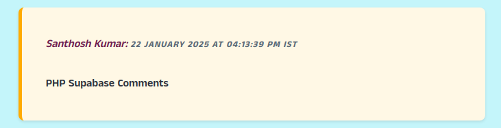
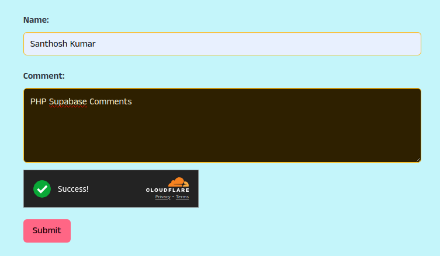

# PHP Supabase Comments

A simple comment system built with PHP and Supabase.  

  

## Features

- PHP (7.4 to 8.x.x) support
- Supabase for storing comments in the database
- Pagination for comments
- Modern and responsive UI using Bulma CSS
- Comprehensive security for input forms and spam prevention
- Cloudflare Turnstile for additional spam protection  

  

  

## setup

- Create a database in Supabase: <https://supabase.com/docs/guides/database/overview>

```sql
-- Create the table with necessary fields
CREATE TABLE user_comments (
    id SERIAL PRIMARY KEY,            -- Auto-incrementing primary key
    name VARCHAR(255) NOT NULL,        -- Name of the user (max length 255)
    comment TEXT NOT NULL,            -- Comment field to store user input
    created_at TIMESTAMP WITH TIME ZONE DEFAULT CURRENT_TIMESTAMP -- Timestamp with timezone
);
```

- Also, create Cloudflare Turnstile: <https://developers.cloudflare.com/turnstile/>
- Create a `.env` file to add the required API keys

```env

## Supabase
supabaseUrl=https://example.supabase.co
apiKey=
pkey=
table=comments

## Cloudflare turnstile
secretKey=
siteKey=
url=https://challenges.cloudflare.com/turnstile/v0/siteverify

```

- Done  

## Base Concept

This project was inspired from Supacomments dev by [@mcnaveen](https://github.com/mcnaveen) - [Blazing fast comment system with Sveltejs and Supabase](https://github.com/mcnaveen/SupaComments)

## LICENSE

MIT
